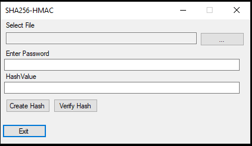
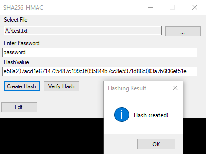
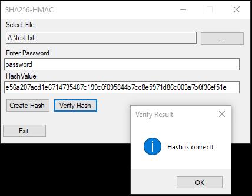
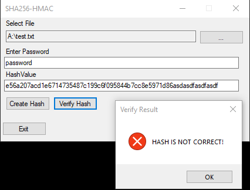

# SHA256HMAC-GUI
Simple GUI Application that calculates a SHA256-HMAC for a given file+password combination.  
_Depending on the files size, hash creation may take some time!_

## Usage

The main window consists of the following 5 elements:

1. **Select File**: Select a file from your computer for which you want to create the SHA256-HMAC. _Note:_ You must have read permissions for this file.
2. **Enter Password**: The password that should be used for the HMAC.
3. **Hash Value**: Either the computed hash value or the hash value to verify against.
4. Buttons **"Create Hash"** and **"Verify Hash"**: Creates or verifies the SHA256-HMAC.
5. Button **"Exit"**: Exits the application

### Create Mode

To create a HMAC for a file, you must first select the file using the _"..."_ Button.  
Then enter the password into the _"Enter Password"_ input field.  
The next step is to click on the _"Create Hash"_ button.  
After the HMAC is calculated, the hex representation is displayed in the field _"Hash Value"_ and a popup displaying a success message appears.

In case of errors, an error message with the stack trace will appear.

### Verify Mode

For HMAC verification, again select a file and enter the password that was used to create the HMAC.  
Next enter the HMAC that has previously been created or given to you by a third party.  
Click on _"Verify Hash"_ to start the verification process.  
If the HMAC is correct, a success message will appear - else an error message (see screenshots below).

Correct Hash | Incorrect Hash
-------------|---------------
 | 
